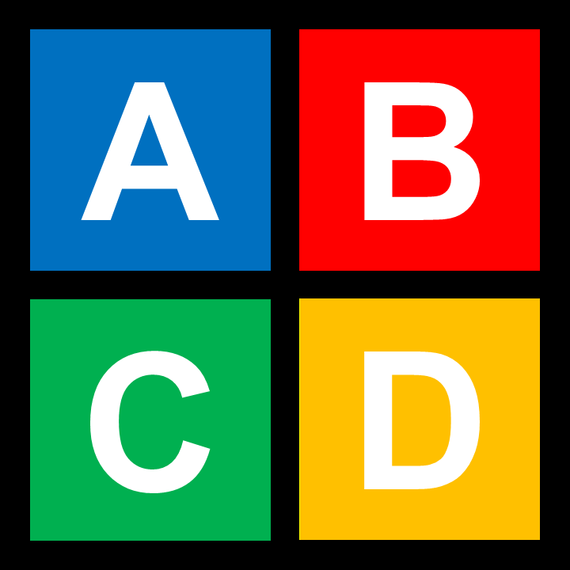

<!-- Multilanguage README.md for fernandoncidade Profile -->

  <b>Selecione o idioma / Select language:</b> 
  <a href="#ptbr">🇧🇷 Português (BR)</a> |
  <a href="#enus">🇺🇸 English (US)</a>

---

<h2 id="ptbr">🇧🇷 Português (BR)</h2>

> # Olá, eu sou o Fernando Nillsson Cidade! 👋

Clique para expandir o README em português

  
  
  

## 📊 Estatísticas dos Meus Repositórios

### 🕒 Total de Tempo Trabalhado: 21789.9h <!-- TOTAL_HOURS_PLACEHOLDER -->
### 📝 Total de Linhas Escritas: 331635 <!-- TOTAL_LINES_PLACEHOLDER -->
### 💻 Total de Commits: 330 <!-- TOTAL_COMMITS_PLACEHOLDER -->

## 📈 Detalhamento por Repositório

> Gerado automaticamente a partir da API pública do GitHub; repositórios privados e forks não entram neste relatório.

<!-- PUBLIC_REPOS_STATS_PT_START -->
| Repositório | Linguagem | Horas | Linhas | Commits | Produtividade (L/H) |
|-------------|-----------|-------|--------|---------|---------------|
| Agenda_Avaliacoes_Academicas | Python | 1047.2h | 13090 | 11 | 12.50 l/h |
| Compression_Manager | Python | 1019.6h | 9804 | 13 | 9.62 l/h |
| Programa_Urna_Eletronica | C++ | 1488.8h | 22332 | 6 | 15.00 l/h |
| Dashboard_Streamlit-Plotly-Pandas_Management | Python | 128.7h | 2340 | 8 | 18.18 l/h |
| Dashboard_Streamlit-Plotly-Pandas_Pareto-Diagram_ABC-Curve | Python | 122.8h | 2232 | 3 | 18.18 l/h |
| Dashboard_TkInter_Pareto-Diagram_ABC-Curve | Python | 149.2h | 2712 | 1 | 18.18 l/h |
| sloth-highlander-theme-1 | CSS/HTML | 604.3h | 9064 | 32 | 15.00 l/h |
| fernandoncidade | HTML | 90.6h | 3090 | 216 | 34.11 l/h |
| Dashboard_Taipy | Python | 12119.3h | 201988 | 3 | 16.67 l/h |
| File_Manager | C++ | 1069.9h | 16048 | 5 | 15.00 l/h |
| Launcher_EBook | C++ | 347.9h | 3163 | 1 | 9.09 l/h |
| Programa_Matriz_NM | C++ | 18.1h | 326 | 2 | 18.01 l/h |
| Programa_Todos_Tipos_Matrizes | C++ | 24.8h | 446 | 2 | 17.98 l/h |
| Programa_Quociente_Resto | C++ | 15.6h | 280 | 2 | 17.95 l/h |
| Programa_Multiplo | C++ | 19.0h | 342 | 2 | 18.00 l/h |
| Programa_Media_Aritmetica | C++ | 42.8h | 770 | 2 | 17.99 l/h |
| Programa_Determinar_Maior_Inteiro | C++ | 16.7h | 300 | 2 | 17.96 l/h |
| Economia_APP | Python | 1715.8h | 21448 | 15 | 12.50 l/h |
| Compare_Following_Follower | Python | 1748.8h | 21860 | 4 | 12.50 l/h |
| **TOTAL** | - | 21789.9h | 331635 | 330 | - |
<!-- PUBLIC_REPOS_STATS_PT_END -->

## 🌻 Sobre Mim 🌻

Sou desenvolvedor de software com experiência em Python, C++ e desenvolvimento de interfaces gráficas (GUI). Tenho interesse especial em automação de tarefas, análise de dados e criação de soluções práticas para o dia a dia, utilizando frameworks modernos como PySide6, PyQt6 e Streamlit.

## 🚀 Habilidades

- **Linguagens:** Python, C++
- **Desenvolvimento de GUI:** PySide6, PyQt6, Tkinter
- **Análise de Dados e Visualização:** Pandas, Plotly, Streamlit
- **Científico e Numérico:** Numpy, Scipy, Matplotlib
- **Gerenciamento de Arquivos e Backup:** Automação e compressão de dados
- **Metodologias de Organização e Produtividade:** Matriz de Eisenhower
- **Controle de Versionamento:** Git e GitHub

## 🌟 Destaque de Projeto: Lumen

  

**Lumen**  
Aplicativo com foco em soluções leves para visualização/organização de dados e utilitários de apoio ao fluxo de trabalho.
- [Microsoft Web Store](https://apps.microsoft.com/detail/9N70CLLMVRPN)

-  

## 📋 Destaque de Projeto: Eisenhower Organizer

  

**Eisenhower Organizer**  
EISENHOWER ORGANIZER é um aplicativo leve para organizar tarefas usando a Matriz de Eisenhower (Importante/Urgente). Permite criar, classificar, marcar como concluídas e exportar/importar tarefas de forma simples e rápida.
- [Microsoft Web Store](https://apps.microsoft.com/detail/9P289X0185C3)

-  

## 🏮 Destaque de Projeto: Linceu Lighthouse

  

**Linceu Lighthouse**  
Ferramenta avançada de monitoramento de integridade de arquivos (FIM), com interface multilíngue, estatísticas detalhadas e exportação flexível de dados.
- [Microsoft Web Store](https://apps.microsoft.com/detail/9NN8Z5Z700TM)

-  

## 👥 Destaque de Projeto: Compare - Following and Follower

  

**Compare - Following and Follower**  
Compare - Following and Follower é um aplicativo desktop para comparar, de forma prática, quem você segue e quem te segue no GitHub. Uma ferramenta para transformar listas grandes de seguidores em decisões claras, sem precisar abrir perfil por perfil.
- [Repositório Compare - Following and Follower](https://github.com/fernandoncidade/Compare_Following_Follower)
- [Leia o README do Compare - Following and Follower](https://github.com/fernandoncidade/Compare_Following_Follower/blob/main/README.md)
-  

## 🎯 Principais Projetos

- [**Agenda Avaliações Acadêmicas**](https://github.com/fernandoncidade/Agenda_Avaliacoes_Academicas): Sistema para gerenciamento de atividades avaliativas em ambientes educacionais, usando PySide6 e módulos personalizados.
- [**Compression Manager**](https://github.com/fernandoncidade/Compression_Manager): Aplicativo de backup e compressão de arquivos com interface gráfica intuitiva, suporte a múltiplos formatos.
- [**Launcher EBook**](https://github.com/fernandoncidade/Launcher_EBook): Aplicação desktop em C++/Qt6 para catalogar e-books e documentos locais, exibir metadados básicos, reportar estatísticas e abrir arquivos com aplicativos associados do sistema ou com um executável escolhido pelo usuário.
- [**Programa Urna Eletrônica**](https://github.com/fernandoncidade/Programa_Urna_Eletronica): Sistema de votação eletrônica em C++, simulando urna eletrônica com apuração automática.

## 📊 Dashboards de Análise de Dados
- [Streamlit/Plotly/Pandas Management](https://github.com/fernandoncidade/Dashboard_Streamlit-Plotly-Pandas_Management)
- [Pareto Diagram/ABC Curve](https://github.com/fernandoncidade/Dashboard_Streamlit-Plotly-Pandas_Pareto-Diagram_ABC-Curve)
- [TkInter Pareto/ABC](https://github.com/fernandoncidade/Dashboard_TkInter_Pareto-Diagram_ABC-Curve)

## 🎓 Formação Acadêmica

*Atualmente sou aluno do curso de Bacharelado em Engenharia Civil, da Universidade Federal do Paraná. Anteriormente cursei Licenciatura em Física na Universidade Tecnológica Federal do Paraná, tenho experiência em docência para o Ensino Médio.*

## 🎯 Objetivos

- Aprimorar conhecimentos em automação, análise de dados e inteligência artificial.
- Ampliar o desenvolvimento de soluções open source e contribuir para a comunidade.
- Explorar novas tecnologias e padrões de desenvolvimento para entregar projetos cada vez mais robustos e eficientes.

  

## 📫 Contato

---

## 📈 Estatísticas GitHub

  

 <em><b>Sempre codando com paixão!</b> 🚀</em> 

  

---

<h2 id="enus">🇺🇸 English (US)</h2>

> # Hello, I'm Fernando Nillsson Cidade! 👋

Click to expand the README in English

  
  
  

## 📊 My Repository Statistics

### 🕒 Total Working Time: 21789.9h <!-- TOTAL_HOURS_PLACEHOLDER -->
### 📝 Total Lines Written: 331635 <!-- TOTAL_LINES_PLACEHOLDER -->
### 💻 Total Commits: 330 <!-- TOTAL_COMMITS_PLACEHOLDER -->

## 📈 Repository Breakdown

> Generated automatically from GitHub's public API; private repositories and forks are not included in this report.

<!-- PUBLIC_REPOS_STATS_EN_START -->
| Repository | Language | Hours | Lines | Commits | Productivity (L/H) |
|------------|----------|-------|-------|---------|--------------|
| Agenda_Avaliacoes_Academicas | Python | 1047.2h | 13090 | 11 | 12.50 l/h |
| Compression_Manager | Python | 1019.6h | 9804 | 13 | 9.62 l/h |
| Programa_Urna_Eletronica | C++ | 1488.8h | 22332 | 6 | 15.00 l/h |
| Dashboard_Streamlit-Plotly-Pandas_Management | Python | 128.7h | 2340 | 8 | 18.18 l/h |
| Dashboard_Streamlit-Plotly-Pandas_Pareto-Diagram_ABC-Curve | Python | 122.8h | 2232 | 3 | 18.18 l/h |
| Dashboard_TkInter_Pareto-Diagram_ABC-Curve | Python | 149.2h | 2712 | 1 | 18.18 l/h |
| sloth-highlander-theme-1 | CSS/HTML | 604.3h | 9064 | 32 | 15.00 l/h |
| fernandoncidade | HTML | 90.6h | 3090 | 216 | 34.11 l/h |
| Dashboard_Taipy | Python | 12119.3h | 201988 | 3 | 16.67 l/h |
| File_Manager | C++ | 1069.9h | 16048 | 5 | 15.00 l/h |
| Launcher_EBook | C++ | 347.9h | 3163 | 1 | 9.09 l/h |
| Programa_Matriz_NM | C++ | 18.1h | 326 | 2 | 18.01 l/h |
| Programa_Todos_Tipos_Matrizes | C++ | 24.8h | 446 | 2 | 17.98 l/h |
| Programa_Quociente_Resto | C++ | 15.6h | 280 | 2 | 17.95 l/h |
| Programa_Multiplo | C++ | 19.0h | 342 | 2 | 18.00 l/h |
| Programa_Media_Aritmetica | C++ | 42.8h | 770 | 2 | 17.99 l/h |
| Programa_Determinar_Maior_Inteiro | C++ | 16.7h | 300 | 2 | 17.96 l/h |
| Economia_APP | Python | 1715.8h | 21448 | 15 | 12.50 l/h |
| Compare_Following_Follower | Python | 1748.8h | 21860 | 4 | 12.50 l/h |
| **TOTAL** | - | 21789.9h | 331635 | 330 | - |
<!-- PUBLIC_REPOS_STATS_EN_END -->

## 🌻 About Me 🌻

I'm a software developer with experience in Python, C++, and GUI development. I'm particularly interested in task automation, data analysis, and creating practical solutions for everyday life using modern frameworks like PySide6, PyQt6, and Streamlit.

## 🚀 Skills

- **Languages:** Python, C++
- **GUI Development:** PySide6, PyQt6, Tkinter
- **Data Analysis & Visualization:** Pandas, Plotly, Streamlit
- **Scientific & Numerical:** Numpy, Scipy, Matplotlib
- **File Management & Backup:** Data automation and compression
- **Organization & Productivity:** Eisenhower Matrix
- **Version Control:** Git and GitHub

## 🌟 Project Highlight: Lumen

  

**Lumen**  
Application focused on lightweight solutions for data visualization/organization and utilities to support the workflow.
- [Microsoft Web Store](https://apps.microsoft.com/detail/9N70CLLMVRPN)

-  

## 📋 Project Highlight: Eisenhower Organizer

  

**Eisenhower Organizer**  
EISENHOWER ORGANIZER is a lightweight application for organizing tasks using the Eisenhower Matrix (Important/Urgent). It allows you to create, sort, mark as completed, and export/import tasks quickly and easily.
- [Microsoft Web Store](https://apps.microsoft.com/detail/9P289X0185C3)

-  

## 🏮 Project Highlight: Linceu Lighthouse

  

**Linceu Lighthouse**  
Advanced file integrity monitoring tool (FIM) with multilingual interface, detailed statistics, and flexible data export.
- [Microsoft Web Store](https://apps.microsoft.com/detail/9NN8Z5Z700TM)

-  

## 👥 Project Highlight: Compare - Following and Follower

  

**Compare - Following and Follower**  
Compare - Following and Follower is a desktop app to compare, in a practical way, who you follow and who follows you on GitHub. A tool to turn large follower lists into clear decisions, without opening profile by profile.
- [Compare - Following and Follower Repository](https://github.com/fernandoncidade/Compare_Following_Follower)
- [Read the Compare - Following and Follower README](https://github.com/fernandoncidade/Compare_Following_Follower/blob/main/README.md)
-  

## 🎯 Main Projects

- [**Academic Evaluations Scheduler**](https://github.com/fernandoncidade/Agenda_Avaliacoes_Academicas): System for managing academic assessment activities, using PySide6 and custom modules.
- [**Compression Manager**](https://github.com/fernandoncidade/Compression_Manager): Applications for backup and file compression with an intuitive GUI, supporting multiple formats.
- [**Launcher EBook**](https://github.com/fernandoncidade/Launcher_EBook): C++/Qt6 desktop application for cataloging local e-books and documents, displaying basic metadata, reporting statistics, and opening files with system-associated apps or a user-selected executable.
- [**Electronic Ballot Program**](https://github.com/fernandoncidade/Programa_Urna_Eletronica): Electronic voting system in C++, simulating a ballot box with automatic tallying.

## 📊 Data Analysis Dashboards
- [Streamlit/Plotly/Pandas Management](https://github.com/fernandoncidade/Dashboard_Streamlit-Plotly-Pandas_Management)
- [Pareto Diagram/ABC Curve](https://github.com/fernandoncidade/Dashboard_Streamlit-Plotly-Pandas_Pareto-Diagram_ABC-Curve)
- [TkInter Pareto/ABC](https://github.com/fernandoncidade/Dashboard_TkInter_Pareto-Diagram_ABC-Curve)

## 🎓 Academic Background

*Currently a student of Civil Engineering at the Federal University of Paraná. Previously studied Physics Teaching at the Federal Technological University of Paraná, with experience teaching high school.*

## 🎯 Goals

- Improve knowledge in automation, data analysis, and artificial intelligence.
- Expand the development of open source solutions and contribute to the community.
- Explore new technologies and development standards to deliver increasingly robust and efficient projects.

  

## 📫 Contact

---

## 📈 GitHub Stats

  

 <em><b>Always coding with passion!</b> 🚀</em> 

  

